<!-- TODO: header image — drop the frame photo at docs/header.jpg and uncomment

  

-->

# The Shard — TPU Parts

3D-printable TPU parts for **The Shard** bando frame: bumpers, digital-VTX holders and frontends,
action-cam mounts, buzzer holders and more.

Print the parts in TPU. The frontends and the action-cam mount are also provided as STEP files so you can modify them.
Thumbnail renders can be regenerated with `python tools/render_thumbnails.py`.

## Recommended Accessory Sets

Pick the accessories matching your VTX build. Either ViFly finder size works — choose the
Finder 2 or Finder Mini holder in the listed orientation.

| Build | Recommended accessories |
| --- | --- |
| **O3** | [Cap & RX Holder](parts/rx_holders/Shard_Cap_RX_Holder.stl) · ViFly finder holder, forwards: [Finder 2](parts/finders/Shard_ViFly_Finder_2_Holder_Forwards.stl) or [Finder Mini](parts/finders/Shard_ViFly_Finder_Mini_Holder_Forwards.stl) |
| **O4 Pro** | [RX Holder](parts/rx_holders/Shard_RX_Holder.stl) · ViFly finder holder, sideways: [Finder 2](parts/finders/Shard_ViFly_Finder_2_Holder_Sideways.stl) or [Finder Mini](parts/finders/Shard_ViFly_Finder_Mini_Holder_Sideways.stl) · [Cap Holder](parts/misc/Shard_Cap_Holder.stl) |

## Arm Bumpers

| Preview | Part | Files |
| :---: | --- | --- |
| <a href="parts/arm_bumpers/Shard_Arm_Bumper_Crystal.stl">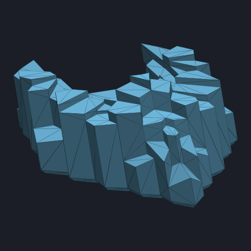</a> | Arm Bumper — Crystal | [STL](parts/arm_bumpers/Shard_Arm_Bumper_Crystal.stl) |
| <a href="parts/arm_bumpers/Shard_Arm_Bumper_Lite.stl">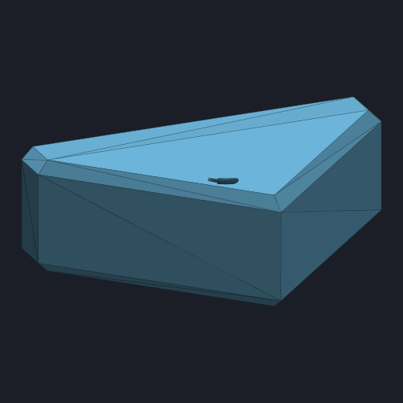</a> | Arm Bumper — Lite | [STL](parts/arm_bumpers/Shard_Arm_Bumper_Lite.stl) |

## VTX

### DJI O3 Air Unit

| Preview | Part | Files |
| :---: | --- | --- |
| <a href="parts/vtx/o3/Shard_VTX_Holder_O3.stl">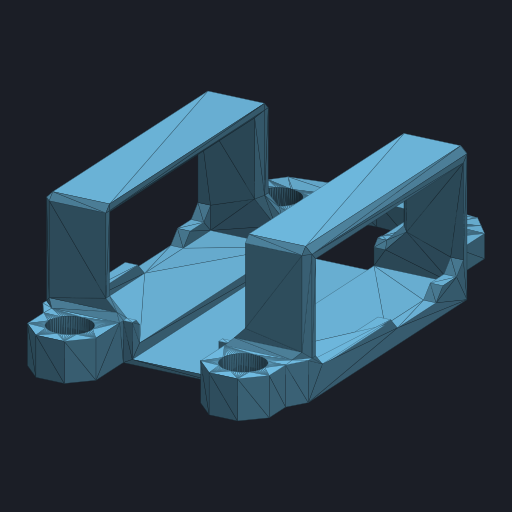</a> | VTX Holder | [STL](parts/vtx/o3/Shard_VTX_Holder_O3.stl) |
| <a href="parts/vtx/o3/Shard_Frontend_O3_25deg.stl">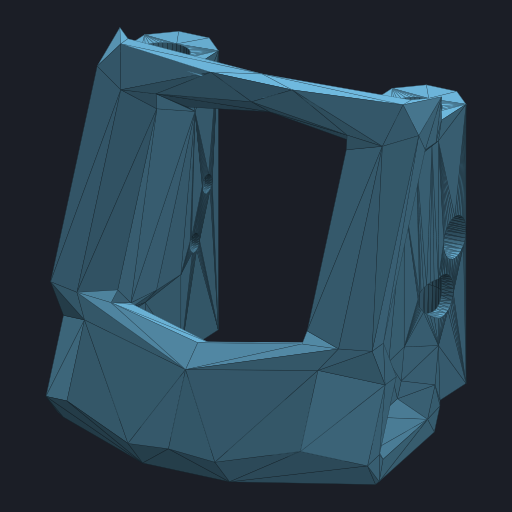</a> | Frontend (camera mount) | STL: [20°](parts/vtx/o3/Shard_Frontend_O3_20deg.stl) · [25°](parts/vtx/o3/Shard_Frontend_O3_25deg.stl) · [30°](parts/vtx/o3/Shard_Frontend_O3_30deg.stl) STEP: [20°](parts/vtx/o3/Shard_Frontend_O3_20deg.step) · [25°](parts/vtx/o3/Shard_Frontend_O3_25deg.step) · [30°](parts/vtx/o3/Shard_Frontend_O3_30deg.step) |

### DJI O4 Air Unit Pro

| Preview | Part | Files |
| :---: | --- | --- |
| <a href="parts/vtx/o4_pro/Shard_VTX_Holder_O4_Pro.stl">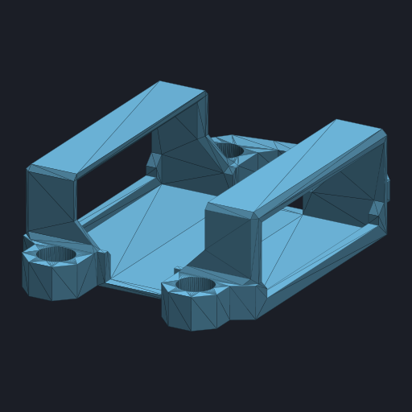</a> | VTX Holder | [STL](parts/vtx/o4_pro/Shard_VTX_Holder_O4_Pro.stl) |
| <a href="parts/vtx/o4_pro/Shard_Frontend_O4_Pro_25deg.stl">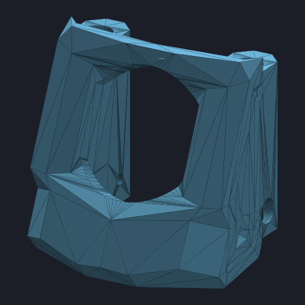</a> | Frontend (camera mount) | STL: [20°](parts/vtx/o4_pro/Shard_Frontend_O4_Pro_20deg.stl) · [25°](parts/vtx/o4_pro/Shard_Frontend_O4_Pro_25deg.stl) · [30°](parts/vtx/o4_pro/Shard_Frontend_O4_Pro_30deg.stl) STEP: [20°](parts/vtx/o4_pro/Shard_Frontend_O4_Pro_20deg.step) · [25°](parts/vtx/o4_pro/Shard_Frontend_O4_Pro_25deg.step) · [30°](parts/vtx/o4_pro/Shard_Frontend_O4_Pro_30deg.step) |
| <a href="parts/vtx/o4_pro/Shard_Frontend_O4_Pro_Itsfpv_25deg.stl">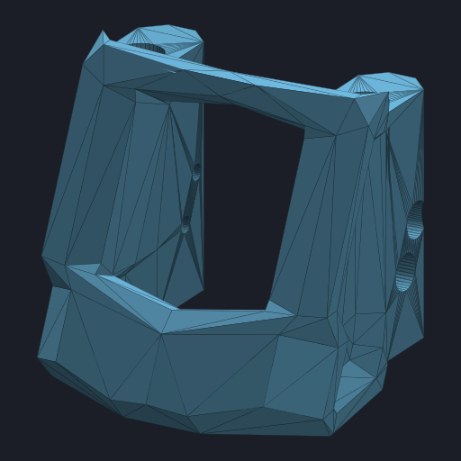</a> | Frontend (Itsfpv camera mount) | STL: [20°](parts/vtx/o4_pro/Shard_Frontend_O4_Pro_Itsfpv_20deg.stl) · [25°](parts/vtx/o4_pro/Shard_Frontend_O4_Pro_Itsfpv_25deg.stl) · [30°](parts/vtx/o4_pro/Shard_Frontend_O4_Pro_Itsfpv_30deg.stl) STEP: [20°](parts/vtx/o4_pro/Shard_Frontend_O4_Pro_Itsfpv_20deg.step) · [25°](parts/vtx/o4_pro/Shard_Frontend_O4_Pro_Itsfpv_25deg.step) · [30°](parts/vtx/o4_pro/Shard_Frontend_O4_Pro_Itsfpv_30deg.step) |

### Analog

| Preview | Part | Files |
| :---: | --- | --- |
| <a href="parts/vtx/analog/Shard_Frontend_Analog_25deg.stl">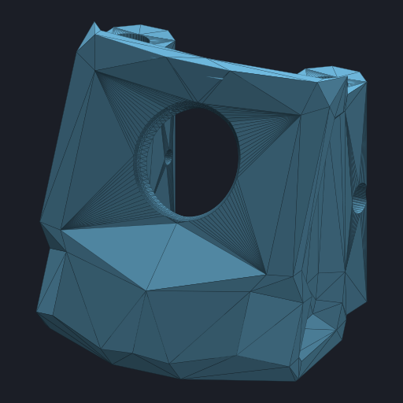</a> | Frontend (camera mount) | STL: [20°](parts/vtx/analog/Shard_Frontend_Analog_20deg.stl) · [25°](parts/vtx/analog/Shard_Frontend_Analog_25deg.stl) · [30°](parts/vtx/analog/Shard_Frontend_Analog_30deg.stl) STEP: [20°](parts/vtx/analog/Shard_Frontend_Analog_20deg.step) · [25°](parts/vtx/analog/Shard_Frontend_Analog_25deg.step) · [30°](parts/vtx/analog/Shard_Frontend_Analog_30deg.step) |

## Action Cams

### DJI Action 2

| Preview | Part | Files |
| :---: | --- | --- |
| <a href="parts/action_cams/dji_action_2/Shard_DJI_Action_2_Mount_25deg.stl">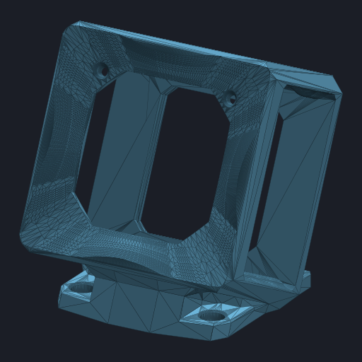</a> | Camera Mount | STL: [20°](parts/action_cams/dji_action_2/Shard_DJI_Action_2_Mount_20deg.stl) · [25°](parts/action_cams/dji_action_2/Shard_DJI_Action_2_Mount_25deg.stl) · [30°](parts/action_cams/dji_action_2/Shard_DJI_Action_2_Mount_30deg.stl) STEP: [20°](parts/action_cams/dji_action_2/Shard_DJI_Action_2_Mount_20deg.step) · [25°](parts/action_cams/dji_action_2/Shard_DJI_Action_2_Mount_25deg.step) · [30°](parts/action_cams/dji_action_2/Shard_DJI_Action_2_Mount_30deg.step) |

The mount is designed to take a 36 × 36 mm, 1 mm thick carbon plate at the back as protection.

## ViFly Finder Mounts

| Preview | Part | Files |
| :---: | --- | --- |
| <a href="parts/finders/Shard_ViFly_Finder_2_Holder_Forwards.stl">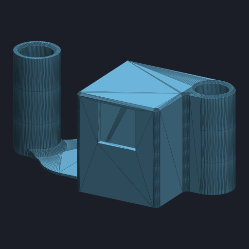</a> | Finder 2 Holder — Forwards | [STL](parts/finders/Shard_ViFly_Finder_2_Holder_Forwards.stl) |
| <a href="parts/finders/Shard_ViFly_Finder_2_Holder_Sideways.stl">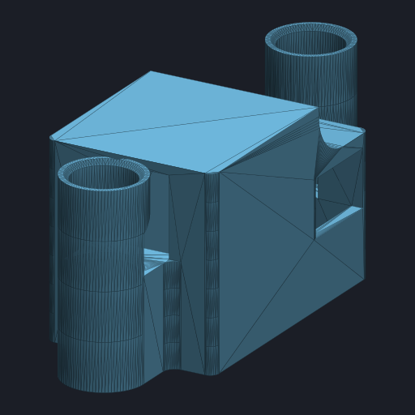</a> | Finder 2 Holder — Sideways | [STL](parts/finders/Shard_ViFly_Finder_2_Holder_Sideways.stl) |
| <a href="parts/finders/Shard_ViFly_Finder_Mini_Holder_Forwards.stl">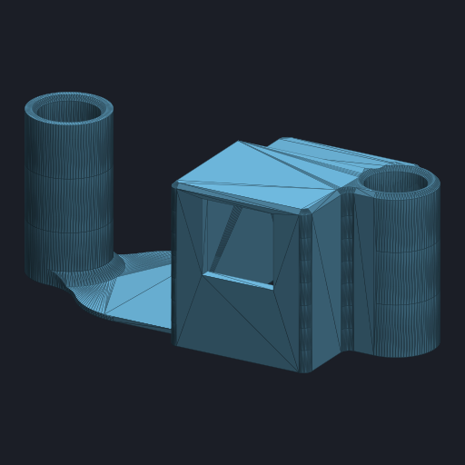</a> | Finder Mini Holder — Forwards | [STL](parts/finders/Shard_ViFly_Finder_Mini_Holder_Forwards.stl) |
| <a href="parts/finders/Shard_ViFly_Finder_Mini_Holder_Sideways.stl">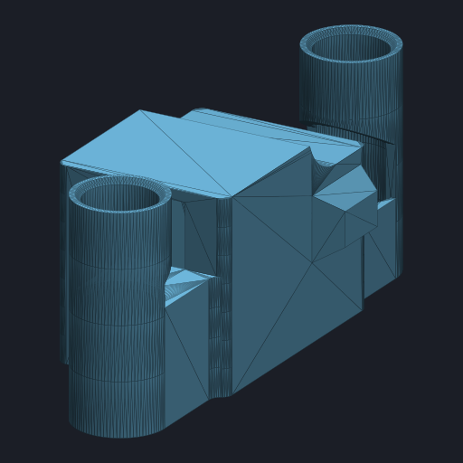</a> | Finder Mini Holder — Sideways | [STL](parts/finders/Shard_ViFly_Finder_Mini_Holder_Sideways.stl) |

## RX Holders

| Preview | Part | Files |
| :---: | --- | --- |
| <a href="parts/rx_holders/Shard_Cap_RX_Holder.stl">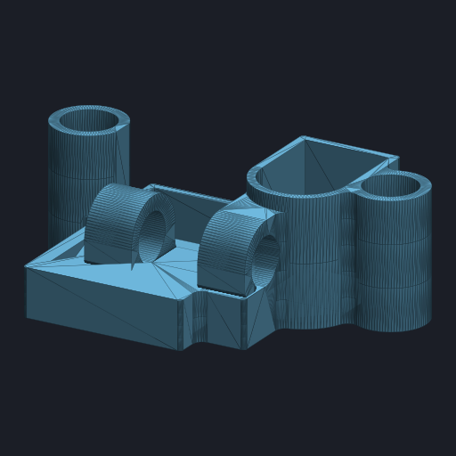</a> | Cap & RX Holder | [STL](parts/rx_holders/Shard_Cap_RX_Holder.stl) |
| <a href="parts/rx_holders/Shard_RX_Holder.stl">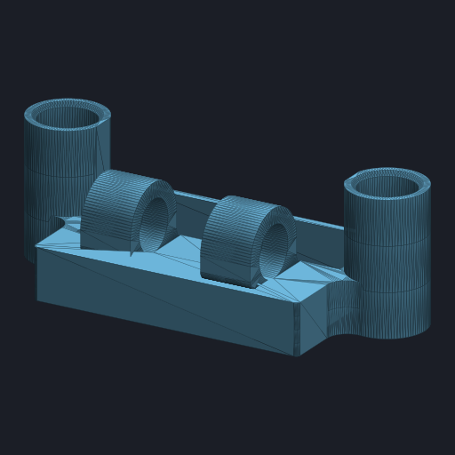</a> | RX Holder | [STL](parts/rx_holders/Shard_RX_Holder.stl) |

## Antenna Backpacks

| Preview | Part | Files |
| :---: | --- | --- |
| <a href="parts/backpacks/Shard_Antenna_Backpack_Dual_Linear.stl">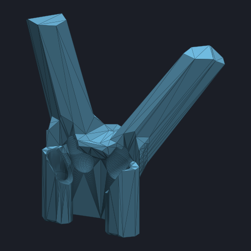</a> | Antenna Backpack — Dual Linear | [STL](parts/backpacks/Shard_Antenna_Backpack_Dual_Linear.stl) |
| <a href="parts/backpacks/Shard_Antenna_Backpack_Single_Mushroom.stl">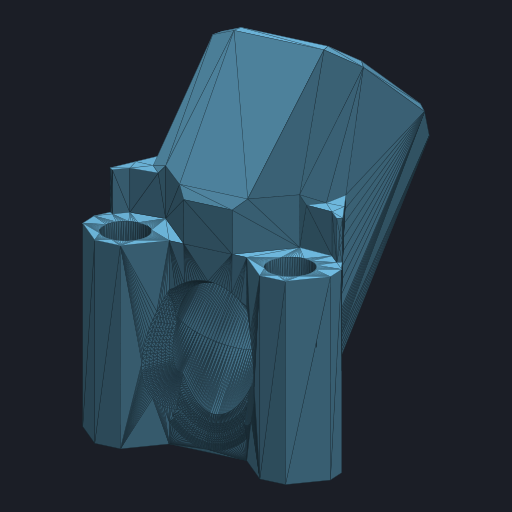</a> | Antenna Backpack — Single Mushroom | [STL](parts/backpacks/Shard_Antenna_Backpack_Single_Mushroom.stl) |

## Misc

| Preview | Part | Files |
| :---: | --- | --- |
| <a href="parts/misc/Shard_Cap_Holder.stl">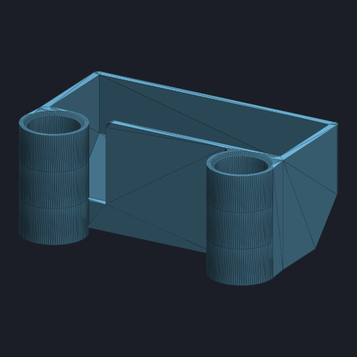</a> | Cap Holder | [STL](parts/misc/Shard_Cap_Holder.stl) |
| <a href="parts/misc/Shard_Crystal_Horn.stl">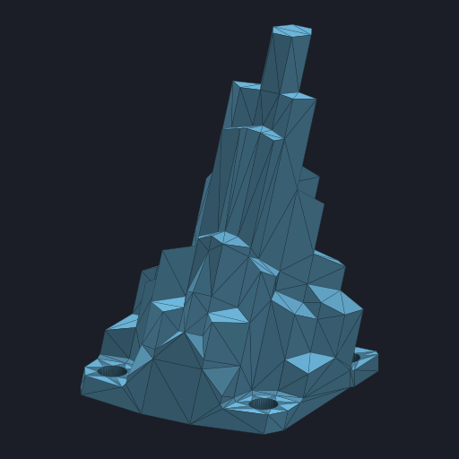</a> | Crystal Horn | [STL](parts/misc/Shard_Crystal_Horn.stl) |
| <a href="parts/misc/Shard_Rear_Bumper.stl">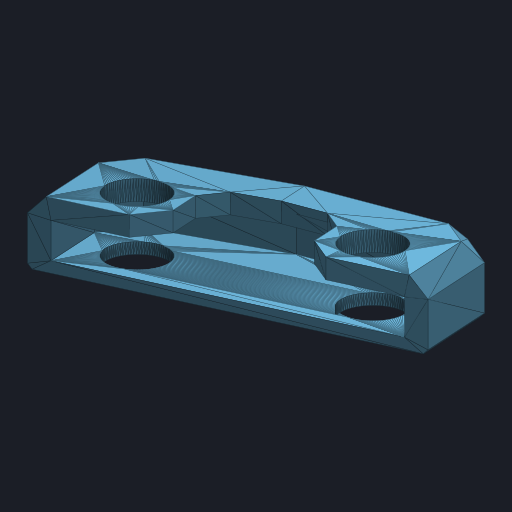</a> | Rear Bumper | [STL](parts/misc/Shard_Rear_Bumper.stl) |
| <a href="parts/misc/Shard_XTLock.stl">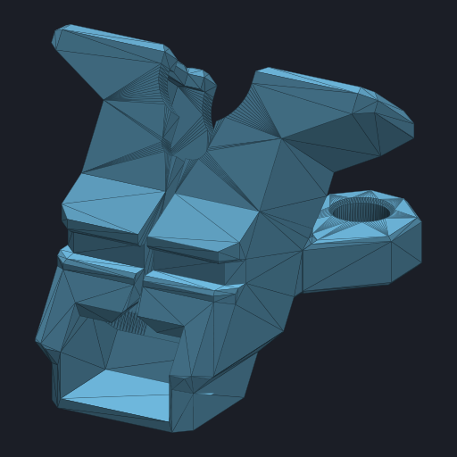</a> | XTLock | [STL](parts/misc/Shard_XTLock.stl) |

## License

These designs are licensed under the
[Creative Commons Attribution-NonCommercial-ShareAlike 4.0 International License](LICENSE).
You are free to print them and share your prints — just give credit, don't sell them, and share
modifications under the same license.
